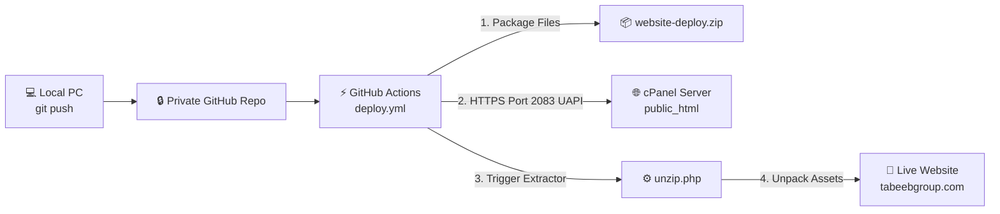

# 🚀 Automated GitHub-to-cPanel Deployment Guide (Private Repositories)

This guide documents the complete automated Continuous Deployment (CI/CD) system configured for this project. With this setup, **every time you push code to GitHub, your live cPanel website updates automatically in ~10 seconds.**

---

## 🏗️ Architecture & How It Works



### Why this architecture?
1. **Works with Private Repositories:** GitHub Actions runs inside GitHub and has native access to private repository code without needing GitHub credentials stored on cPanel.
2. **Bypasses Port 21 (FTP):** Many shared hosting providers block or disable plain FTP (causing `ECONNREFUSED :21`). This setup communicates over cPanel's standard **HTTPS port 2083**, which is always open.
3. **Bypasses Port 22 (SSH):** Avoids hosting provider shell restrictions, SSH key configuration errors, and `known_hosts` prompts.
4. **Zero-Downtime & Clean:** Automatically unpacks all HTML, CSS, JavaScript, `.htaccess`, and media files, then removes the temporary archive.

---

## 🛠️ Project Configuration Files

The deployment pipeline is powered by two files in the repository:

### 1. `.github/workflows/deploy.yml`
Handles the CI/CD pipeline when commits are pushed:
- **Triggers:** On push to `main` or `rebrand-tabeeb-contractor`.
- **Packaging:** Bundles the website into `website-deploy.zip` while excluding git metadata, markdown docs, and temp files.
- **Upload:** Sends the zip and `unzip.php` to `/home/tabeebgroup/public_html/` using cPanel's `Fileman/upload_files` UAPI over HTTPS port 2083.
- **Extraction:** Pings `https://tabeebgroup.com/unzip.php` to immediately unpack all files directly into the web root.

### 2. `unzip.php`
A lightweight server-side helper executed by PHP on the LiteSpeed server:
- Opens `website-deploy.zip`.
- Overwrites/updates all files in `public_html/`.
- Deletes `website-deploy.zip` after successful extraction.
- Returns a JSON status report to GitHub Actions.

---

## 🔑 Required Secrets (GitHub Settings)

To allow GitHub to authenticate with your cPanel account, the following secret is configured in:
👉 **GitHub Repo ➔ Settings ➔ Secrets and variables ➔ Actions**

| Secret Name | Value Description | Configured Status |
| :--- | :--- | :--- |
| `CPANEL_API_TOKEN` | Token generated in cPanel ➔ *Manage API Tokens* | ✅ Active |
| `CPANEL_USERNAME` | *(Optional)* Defaults to `tabeebgroup` | Pre-configured |
| `CPANEL_HOST` | *(Optional)* Defaults to `151.158.158.31` | Pre-configured |

---

## 🔄 Day-to-Day Workflow (How to Update Your Website)

Whenever you make changes to the website code:

### Step 1: Make your changes locally
Edit your HTML, CSS, JavaScript, or images in your editor.

### Step 2: Commit and push
```bash
git add .
git commit -m "Update homepage contact section"
git push origin rebrand-tabeeb-contractor
```

### Step 3: Deployment runs automatically
1. Open the **Actions** tab in your GitHub repository:
   [https://github.com/MdAbdurRahaman/Kurikhai-Construction/actions](https://github.com/MdAbdurRahaman/Kurikhai-Construction/actions)
2. Watch the green checkmark appear (~10 seconds).
3. Open your live website at **[https://tabeebgroup.com](https://tabeebgroup.com)** and press **`Ctrl + F5`** (hard refresh) to see your changes!

---

## 📋 Replicating for Another Project / cPanel Account

If you ever need to set this up for a new website or another cPanel hosting account, follow these 4 quick steps:

### 1. Generate cPanel API Token
1. Log into the target cPanel dashboard.
2. Search for **Manage API Tokens** (under *Security*).
3. Click **+ Create**, give it a name (e.g. `github-actions-deploy`), and click **Create Token**.
4. Copy the token.

### 2. Add Secret to GitHub
1. Open the GitHub repository ➔ **Settings** ➔ **Secrets and variables** ➔ **Actions**.
2. Click **New repository secret**:
   - **Name**: `CPANEL_API_TOKEN`
   - **Value**: Paste the cPanel token.

### 3. Copy `unzip.php` and `.github/workflows/deploy.yml`
Copy these two files into your new project. In `deploy.yml`, update:
- `CPANEL_USER`: Your cPanel username.
- `CPANEL_HOST`: Your server IP or domain.
- `dir=public_html`: Your target web root folder (e.g., `public_html` or an addon domain directory).
- Extraction URL: `https://yourdomain.com/unzip.php`.

### 4. Push to GitHub
Run `git push` — your new website will be automatically deployed!
